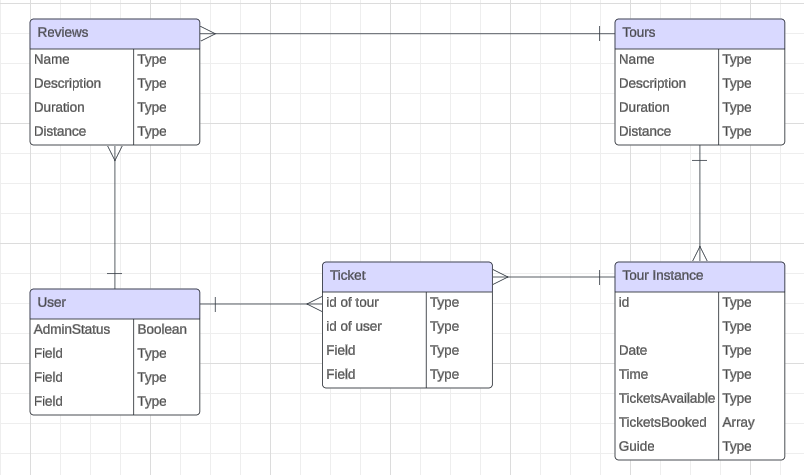

# Walk and Sketch Booking Platform

This is a tour booking app for a small town in Alaska. Tourists are offered several tours to choose from where they will be taken on a hike to scenic overlooks where the guide will provide a brief art lesson. Tourists can spend time in nature on their vacation and go home with unique art that they created. This is an imaginary business inspired from the creator's time spent living in Alaska. 

The app has 2 levels of user credentials, Admin and User. Admin level accounts are intended to be used by the guides. They have the ability to add, edit and delete new tours on the site. They may also book tours to attend. Whereas users only have the ability to book or delete their own tickets for tours. 

Technologies used:
MongoDb
Express
React
Node.js
Bootstrap
JWT
Heroku

Resources:

Future Additions:
Reviews
More content
Additional styling
Capacity cap users registered for you
Count function for currently registered attendents 
Google OAuth

 

